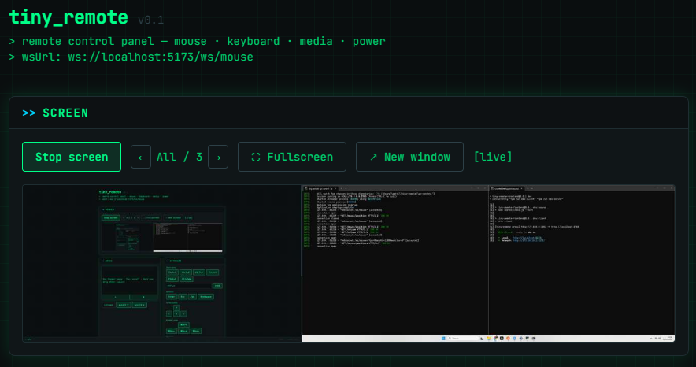

# Tiny Remote



Tiny Remote lets you control your PC from another device on your local network.  
It is built for "across-the-room" control: browser shortcuts, typing, mouse actions, volume, and power controls from a phone, tablet, or second laptop.

## Why Tiny Remote Exists

The project came from a real studio-apartment constraint: no space for a TV setup.  
Using a desktop from a distance quickly became a peril: hard to type, hard to trigger browser shortcuts, hard to navigate comfortably from bed or another corner of the room.

Tiny Remote was born to solve that problem with a lightweight remote-control stack that is simple to run and fast to use.

## What It Does

- Remote mouse movement, click, drag, and scroll
- Remote keyboard typing and shortcut/hotkey triggers
- Volume control and mute toggle
- Power actions (lock, sleep, shutdown, restart, cancel)
- Browser-friendly control UI
- Local-network usage without cloud dependency

## Project Structure

```text
tiny-remote/
|- assets/                # Demo image and media
|- frontend/              # React + Tailwind + Express proxy UI
|- pc-control/            # FastAPI backend for device control
|- desktop/               # Desktop runtime-related files
|- installer/             # Installer scripts/config
|- scripts/               # Utility scripts (e.g., firewall)
|- run.bat                # Starts frontend + backend dev processes
|- build-installer.bat    # Builds installer artifacts
```

## How It Works

1. A remote device opens the frontend UI.
2. The UI sends API calls through an Express proxy.
3. The FastAPI backend on the host machine performs mouse/keyboard/media/power actions.
4. Commands execute on the same PC running `pc-control`.

Everything is intended for trusted local-network use.

## Quick Start (Windows)

### 1) Backend (`pc-control`)

```bat
cd pc-control
python -m venv .venv
.venv\Scripts\activate
pip install -r requirements.txt
run.bat
```

Backend listens on `http://0.0.0.0:8765`.

### 2) Frontend (`frontend`)

```bat
cd frontend
npm install
npm run dev
```

Typical dev endpoints:

- Frontend (Vite): `http://localhost:5173`
- Express proxy: `http://localhost:3001`

### 3) Start both from root

```bat
run.bat
```

This launches:

- Frontend dev stack
- `pc-control` backend

## Core API Areas (Backend)

The backend includes endpoints for:

- `mouse/*`
- `keyboard/*`
- `volume/*`
- `power/*`

For interactive docs when backend is running:

- `http://localhost:8765/docs`

## Security Note

Tiny Remote currently has no built-in authentication.  
Use only on a trusted private network. Do not expose this service directly to the public internet without adding authentication and transport security.

## Roadmap

- Package Tiny Remote as an easy-to-install `.exe`
- Improve one-click startup and first-run setup
- Add optional authentication for safer shared-network usage
- Expand remote control presets for browser/media workflows

## Contribution

If you want to contribute, open an issue or PR with:

- Bug reports with reproduction steps
- UX improvements for remote use on small screens
- Performance and reliability improvements for control actions

## License

No license file is currently defined in this repository. Add one before public distribution.
